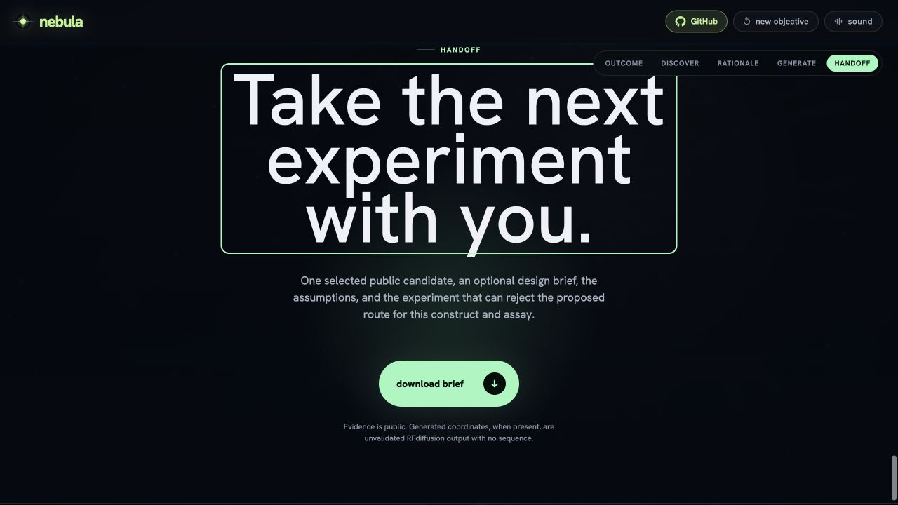

# Nebula

**The next quantum sensing mechanism may already be encoded in biology.**

[](./LICENSE)
[](./CLAUDE_USE.md)
[](https://nebula-discover.greenforest-ed82ac43.westeurope.azurecontainerapps.io)

**Nebula is an open discovery physics engine built by Aniruddh Goteti.** Give it a supported biosensing objective and it maps that objective to implemented mechanism routes, retrieves a bounded set of route-compatible public protein records, applies bounded diagnostics where the evidence permits, and returns a falsifiable discovery dossier.

Nebula does **not** measure proteins, predict a working sensor, or turn simulation into evidence. It makes the frontier searchable and the next experimental question inspectable.

**[Launch Nebula — no install](https://nebula-discover.greenforest-ed82ac43.westeurope.azurecontainerapps.io)**


> Nebula opens with the frontier and states the boundary before an objective is entered: evidence and unknowns, never a working-sensor prediction.

## Why Nebula now

Protein quantum sensing is no longer only a speculative idea. Recent primary research has established several specific experimental systems:

| Experimental precedent | What was shown | Boundary that still matters |
| --- | --- | --- |
| [EYFP spin qubit · Nature 2025](https://www.nature.com/articles/s41586-025-09417-w) | Optical spin readout and coherent microwave control at cryogenic temperature; room-temperature ODMR in *E. coli* | A triplet spin-1 route, not a general rule for finding useful proteins |
| [Engineered MagLOV · Nature 2026](https://www.nature.com/articles/s41586-025-09971-3) | Magnetic-field effects and room-temperature ODMR in living bacterial cells, including single-cell measurements | Evidence for the measured engineered variants, not flavoproteins in general |
| [CraCry and iLOV · Nature Biotechnology 2026](https://www.nature.com/articles/s41587-026-03158-5) | Ambient optically detected and radio-wave-controlled spin chemistry in selected flavoproteins | Mechanism and photochemical outcome remain protein- and condition-specific |

Together, these papers establish a frontier—not a universal recipe that turns a sequence or structure into predicted sensing performance. Nebula addresses the narrower decision this leaves: which public mechanism hypothesis is grounded enough to justify a falsifiable measurement next.

Different proteins can expose a similar optical readout through different physics. EYFP's readout comes from a metastable triplet. The flavoprotein studies investigate spin-correlated radical-pair explanations whose certainty and photochemistry remain system- and condition-specific. Those routes require different cofactors, evidence gates, model assumptions, controls, and falsifiers. Nebula starts with the mechanism before it starts ranking proteins.

## What the engine does

```text
sensing objective
  → structured constraints
  → eligible mechanism routes
  → public protein retrieval and evidence gates
  → structure-conditioned physics where eligible
  → synthetic assumption sweeps
  → evidence and frontier discovery lanes
  → falsification dossier and collaborator handoff
```

| Stage | What Nebula actually does | What it refuses to infer |
| --- | --- | --- |
| **Compile** | Turns the sensing quantity, readouts, environment, and practical constraints into a typed objective | Free-form intent is not treated as evidence |
| **Route** | Selects mechanism families before retrieval | ODMR or fluorescence alone does not identify a mechanism |
| **Search** | Runs bounded, route-specific UniProt query plans, then enriches records through InterPro, RCSB, and AlphaFold | A database hit is not a sensing result |
| **Gate** | Requires route-compatible family and cofactor support; structure evidence controls deeper physics eligibility | A convenient seed is never relabelled to fit another route |
| **Compute** | For at most one eligible flavin candidate per run—the best-resolution cofactor-bound experimental structure—attempts a fixed-geometry UHF cluster diagnostic and derives structure-associated radical-pair geometry when coordinates are available | The outputs are not sensitivity, detectability, confidence, or predicted response |
| **Sweep** | Displays a versioned model-flavin RadicalPy artifact with counterfactual controls; where candidate geometry is available, computes or replays named D/J and kinetic-sensitivity scenarios | Neither result is a candidate-response prediction or statistical interval |
| **Rank** | Separates evidence-backed and frontier hypotheses with explicit, uncalibrated triage axes | A rank is not probability of success |
| **Falsify** | Exports the observable, controls, null, repeat plan, rejection rule, missing information, and claim ceiling | The handoff is not a completed assay or a measurement |

This is a pipeline workflow, not a model wrapper. Retrieval cannot silently become validation; physics cannot silently become performance; ranking cannot silently become probability.

### Implemented objective routes

| Sensed quantity | Retrieval routes in the current backend |
| --- | --- |
| Magnetic or radio-frequency field | Cryptochrome–FAD and LOV–FMN radical-pair routes |
| Redox potential | Redox/electrochemical flavoprotein route |
| Light history | LOV–FMN photochemical route |
| Optical spin contrast | Triplet fluorescent-protein proxy route |

An unsupported or ambiguous sensing target can stop explicitly. Expert family and cofactor constraints may narrow an eligible route; they cannot replace the sensing target or force an unsupported protein through another mechanism.

## See one discovery run

### 1. Search public protein space by mechanism


The constellation uses declared, uncalibrated heuristics: mechanism support on the horizontal axis and information gain on the vertical axis. Lane colour keeps evidence-backed and frontier hypotheses separate.

### 2. Compute only inside the evidence boundary


For Q8LPD9, the fixture-backed run exposes candidate-associated radical-pair geometry and a bounded structure-extracted cluster diagnostic. The visible label keeps the boundary explicit: **reference radical-pair model, a synthetic assumption sweep, not Q8LPD9**. The calculation remains an isolated-cluster diagnostic, not whole-protein spin physics.

### 3. End with a way to be wrong



The screen marks the handoff boundary. Downloading the brief carries the selected accession, public evidence, model assumptions, controls, null expectation, rejection rule, missing information, and claim ceiling into a print-ready collaborator document. Nebula stops before measurement.

## Claim boundary

Nebula is deliberately strict about the difference between discovery and proof.

- It does not claim that a returned protein is a validated or working sensor.
- It does not predict performance, sensitivity, detectability, or probability of success.
- Its ranking axes are uncalibrated triage heuristics.
- Its candidate-specific calculation is an isolated neutral-doublet isoalloxazine cluster: truncated, fixed-geometry, basis-dependent, and missing the radical partner, protonation alternatives, protein environment, and dynamics.
- Its RadicalPy trace is a versioned mechanism-class scenario sweep, not a candidate response prediction.
- It does not run wet-lab measurements or generate experimental evidence.
- A route-compatible instrument class is a measurement scenario, not an equipment recommendation or proof that a signal will be detectable.

See [IP_BOUNDARY.md](./IP_BOUNDARY.md) and [docs/DATA_CONTRACTS.md](./docs/DATA_CONTRACTS.md).

## Quickstart

### One command with Docker

```bash
docker compose up --build
# open http://localhost:8000
```

For a deterministic run from committed public fixtures—seed 1337, no public-API traffic:

```bash
NEBULA_OFFLINE=1 docker compose up --build
```

### Developer mode

```bash
npm ci
python3 -m pip install -e './backend[dev,physics]'

# terminal 1
cd backend && python3 -m uvicorn app.api.main:app --host 127.0.0.1 --port 8000

# terminal 2, from the repository root
npm run dev
```

Open <http://127.0.0.1:5173>. The base backend includes RadicalPy. The `physics` extra adds PySCF for uncached UHF attempts; omit `,physics` for the lighter cache-only QM path. Native scientific dependencies may require a build toolchain, and unavailable calculations remain explicitly labelled as non-computed.

## Runtime architecture

```text
React + TypeScript interface
        ↓ /api
FastAPI objective compiler and run state machine
        ↓
public providers → evidence assembly → physics eligibility
        ↓
candidate-specific diagnostics + mechanism-class sweeps
        ↓
two-lane ranking → dossier → downloadable brief
```

The browser application calls the FastAPI path under [`backend/app`](./backend/app). The deterministic TypeScript core under [`src/core`](./src/core) is a reference implementation used by its own test suite; the two paths are kept explicit rather than presented as one runtime.

## Optional design frontier

Every completed run includes a separate, clearly labelled no-coordinate design-brief lane. Real RFdiffusion backbone generation is optional and on-demand through the deployer's endpoint. Neither affects public-candidate ranking or yields a validated construct.

```bash
pip install modal
modal token new
export RFDIFFUSION_TOKEN="$(openssl rand -hex 24)"
modal secret create nebula-rfdiffusion RFDIFFUSION_TOKEN="$RFDIFFUSION_TOKEN"
modal deploy infra/modal/rfdiffusion_modal.py

export NEBULA_DESIGN_ADAPTER=modal
export NEBULA_MODAL_RFDIFFUSION_URL="https://<you>--nebula-rfdiffusion-generate.modal.run"
export NEBULA_MODAL_RFDIFFUSION_TOKEN="$RFDIFFUSION_TOKEN"
```

Those exports configure developer mode. `docker-compose.yml` does not forward the adapter variables by default; pass them explicitly when deploying or running the container. Credentials stay in your environment, and errors degrade to the deterministic no-coordinate preview. See [docs/DESIGN_ADAPTERS.md](./docs/DESIGN_ADAPTERS.md).

## Host it yourself

FastAPI serves the built React application and API from one container.

```bash
docker build -t nebula .
docker run -p 8000:8000 nebula
```

| Variable | Default | Purpose |
| --- | --- | --- |
| `NEBULA_OFFLINE` | `0` | `0` uses public APIs; `1` uses deterministic committed fixtures |
| `NEBULA_CORS_ORIGINS` | `""` | Comma-separated allowed origins; same-origin deployment needs none |
| `NEBULA_STATIC_DIR` | `/app/dist` | Built interface served by FastAPI |
| `NEBULA_DESIGN_ADAPTER` and Modal variables | unset | Opt-in RFdiffusion adapter |

The default image excludes PySCF. It replays committed, content-addressed UHF cache entries for the demo candidate; uncached candidates remain uncomputed. Build [Dockerfile.physics](./Dockerfile.physics) to enable bounded live UHF attempts for eligible flavin candidates. The live app runs on Azure Container Apps and is deployed manually: build the single container image and roll a new revision with the Azure CLI.

## AI-assisted development

Nebula was built by Aniruddh Goteti with repository-visible assistance from Claude Code: 13 agents, 27 skills, and 9 commands under [.claude/](./.claude), plus dated decision records under `artifacts/claude/`. The contracts, claim boundaries, interface, and tests retain that provenance. See [CLAUDE_USE.md](./CLAUDE_USE.md) and [CLAUDE_TRANSPARENCY.md](./CLAUDE_TRANSPARENCY.md).

The repository also contains a deterministic ten-lens review-swarm reference under [`src/core/swarm`](./src/core/swarm). It is not invoked by the current FastAPI-connected browser path; Nebula does not claim that every browser run passed it. Claude itself does not run inside the shipped application, and AI output is never treated as experimental evidence.

## Project status

Nebula is an early, working research tool.

| Capability | Status |
| --- | --- |
| Objective compiler, mechanism routing, public retrieval, and evidence gates | Implemented |
| Structure-associated radical-pair geometry and at most one bounded candidate-specific UHF cluster attempt per run | Implemented; requires an eligible cofactor-bound experimental structure |
| Versioned RadicalPy reference artifact plus optional candidate D/J and kinetic scenarios | Implemented; assumption envelopes, not predicted response |
| Evidence/frontier ranking and downloadable falsification handoff | Implemented |
| Deterministic offline fixture path with seed 1337 | Implemented |
| Optional RFdiffusion briefs and user-owned Modal adapter | Implemented; separate from discovery ranking |
| TypeScript post-pipeline review swarm | Reference implementation; not on current browser runtime path |
| Broader mechanisms, calibrated ranking, and a named external user study | Planned |

## Contributing

Issues and pull requests are welcome—especially route-gating counterexamples, incorrect evidence relations, missing controls, and objectives that expose an unsafe inference.

Before a pull request, run:

```bash
npm test
npm run build
cd backend && python3 -m pytest -q
cd .. && npm run e2e
```

## License and contact

[MIT](./LICENSE). Free to use, fork, and build on.

Built and maintained by Aniruddh Goteti. Questions or collaboration: [aniruddh.goteti@orbion.life](mailto:aniruddh.goteti@orbion.life).
