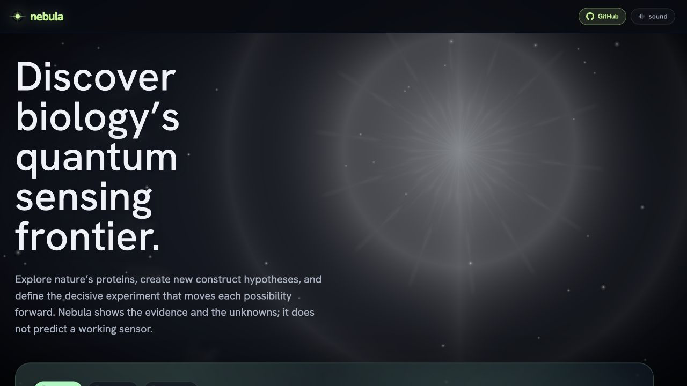
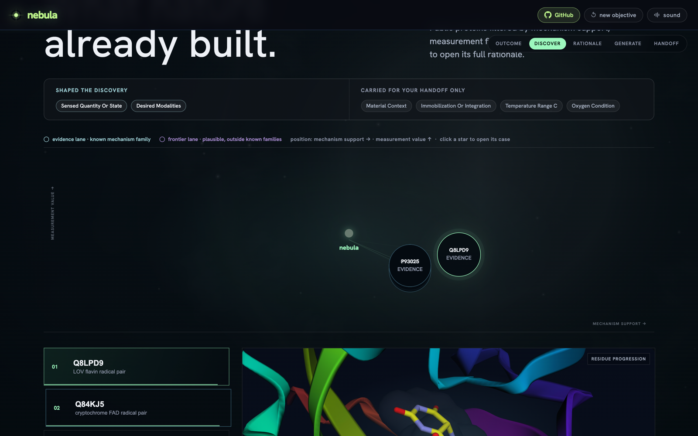
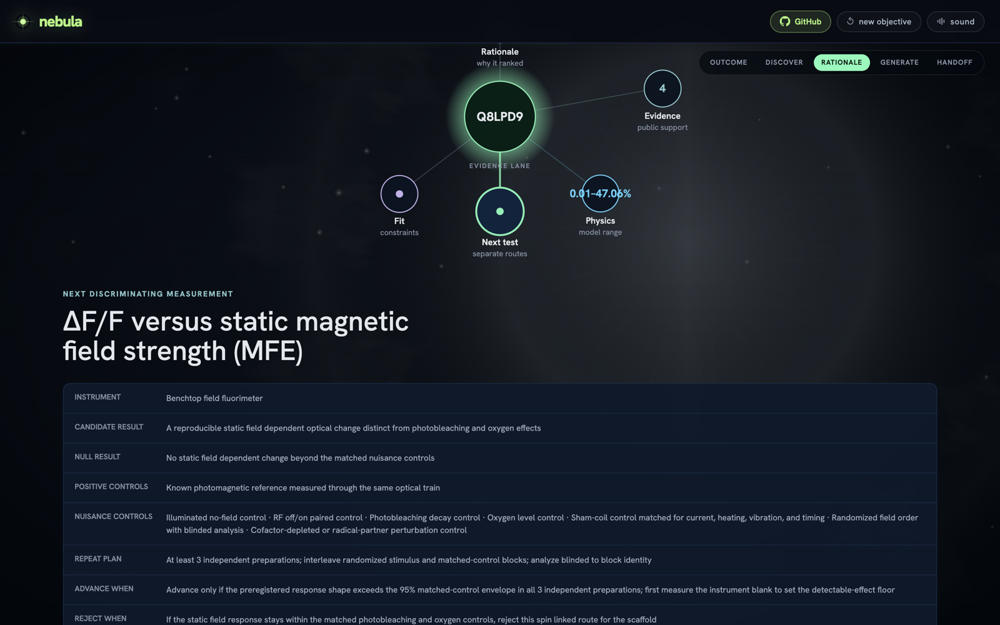

# Nebula

**Discover biology's quantum sensing frontier.**

[](./LICENSE)
[](./CLAUDE_USE.md)
[](https://nebula-discover.greenforest-ed82ac43.westeurope.azurecontainerapps.io)

Nebula is an open tool from [Orbion](https://www.orbion.life) that turns a biosensing objective into a measurement ready protein hypothesis. It searches public protein knowledge (UniProt, InterPro, RCSB, AlphaFold), keeps only candidates whose family, cofactor, and structural evidence support a real sensing mechanism, and returns the single most decision relevant next experiment: a specific protein, the instrument to use, the controls to run, and the result that would rule it out. It helps you decide what to measure. It never claims a protein is a working sensor.

**Try it now, no install:** https://nebula-discover.greenforest-ed82ac43.westeurope.azurecontainerapps.io



> The objective builder. You describe the sensing world, the signal, and the practical constraints; Nebula turns that into a public protein search and a falsifiable measurement brief.

## Contents

- [Why this matters](#why-this-matters)
- [Who it is for](#who-it-is-for)
- [What Nebula does not claim](#what-nebula-does-not-claim)
- [Quickstart](#quickstart)
- [How it works](#how-it-works)
- [Bring your own GPU](#bring-your-own-gpu)
- [Host it yourself](#host-it-yourself)
- [Built with Claude](#built-with-claude)
- [Scientific boundary](#scientific-boundary)
- [Project status](#project-status)
- [Contributing](#contributing)
- [License and contact](#license-and-contact)

## Why this matters

Predicting a protein's shape is now cheap. The AlphaFold database holds [over 200 million predicted structures](https://alphafold.ebi.ac.uk/about), while the Protein Data Bank holds about [256,000 experimentally determined ones](https://www.rcsb.org/), roughly one in a thousand. The slow and expensive step is no longer structure. It is measuring what a protein actually does.

That gap is widest for **quantum biosensors**: proteins whose spin chemistry responds to a magnetic field, a redox change, or light. The promise is a genetically encoded, label free way to read the chemistry of living tissue, sensing weak fields, free radicals, and redox states at the molecular scale. Nature may already do this. The radical pair mechanism in cryptochrome is the [leading hypothesis for avian magnetoreception](https://www.nature.com/articles/s41467-024-55124-x), and quantum sensing of free radicals has been [demonstrated inside living human cells](https://pmc.ncbi.nlm.nih.gov/articles/PMC8880378/). If the field delivers, it gives biomedicine a new instrument for early disease signals, oxidative stress, and how a drug acts, read in real time.

Getting there means testing candidate proteins one at a time on scarce instruments such as EPR and ODMR, where a single slot can be booked months out and most candidates fail their controls. Choosing the wrong protein to measure is a large, quiet cost. Studies estimate that [about 28 billion US dollars a year](https://journals.plos.org/plosbiology/article?id=10.1371/journal.pbio.1002165) of United States preclinical research does not reproduce.

Nebula is the decision layer for that choice. It does not build the sensor and it does not run the experiment. It tells you, with the evidence laid out, which protein is worth the next measurement and how to design that measurement so the result is trustworthy either way.

## Who it is for

Nebula is built for teams that own candidate triage under a scarce measurement budget.

| Who | The job to be done | Why Nebula |
| --- | --- | --- |
| **Genetically encoded spin and magneto sensor engineers** | Pick a starting scaffold before burning slow, costly design build test learn cycles across thousands of candidates, most of which show no usable spin resonance. | Pre filters public databases to cofactor bearing families with a plausible radical pair route and returns a specific accession, next measurement, and controls. |
| **Quantum biology, spin chemistry, and magnetoreception labs** | Candidate identity is the field's live dispute; justifying the next protein to study is contested and effortful. | Evidence gated candidate lists plus a bounded per protein spin diagnostic and an explicit stop rule give a defensible, reviewable next measurement spec. An expert idea generator, not an oracle. |
| **EPR, ODMR, and in cell ESR core facilities** | Pulse EPR and ODMR slots are scarce, expensive, and setup heavy; a no signal construct wastes an irreplaceable slot. | Screens candidates before allocation and outputs the instrument class, required controls, and a stop rule, so scarce instrument time goes to samples likely to give signal. |
| **NV diamond and optical magnetometry teams** | Exquisite sensors, but little fluency in protein databases; the reverse problem of which biological target to measure. | Translates a biosensing objective into a concrete protein and measurement plan, bridging the physics to protein gap. |
| **Redox and photochemical biosensor engineers** | Candidate selection is the acknowledged screening bottleneck in the design build test learn loop. | For redox, ROS, and light responsive scaffolds, the cofactor and mechanism gate helps choose which scaffold to build first. |

## What Nebula does not claim

Nebula is a triage and idea tool, not an oracle. It is deliberate about its limits.

- It does not claim any protein is a validated or working sensor.
- It does not predict performance, sensitivity, or a probability of success. Its ranking axes are uncalibrated triage heuristics.
- The per protein spin number is a coarse, basis dependent estimate under stated assumptions, not a response prediction.
- It does not run wet lab experiments or generate experimental evidence.
- Radical pair magnetoreception is a leading hypothesis, not settled science. Nebula surfaces the evidence and the unknowns; it does not resolve the debate.

Every result carries its assumptions on screen, and a built in claim firewall keeps unvalidated results from being written up as validated ones.

## Quickstart

### One command with Docker

The whole application, the React interface plus the FastAPI service and the physics, runs from a single container.

```bash
docker compose up --build
# then open http://localhost:8000
```

For a deterministic, no network run served from committed public fixtures (seed 1337, ideal for reproducible demos or CI):

```bash
NEBULA_OFFLINE=1 docker compose up --build
```

### Developer mode with hot reload

```bash
npm ci
python3 -m pip install -e './backend[dev,physics]'

# terminal 1: API and live public database retrieval
cd backend && python3 -m uvicorn app.api.main:app --host 127.0.0.1 --port 8000

# terminal 2: Vite dev server
npm run dev
```

Open http://127.0.0.1:5173. The `physics` extra pulls PySCF and RadicalPy, which need a C toolchain. Both are optional and degrade gracefully, and the offline path does not require them. Drop `,physics` to skip.

## How it works

You give Nebula an objective. It returns one decision.

```text
sensing objective  (a signal to sense, plus practical constraints)
  -> mechanism specific search across UniProt, InterPro, RCSB, AlphaFold
  -> keep a protein only when family, cofactor, and structure support the route
  -> a bounded per protein spin diagnostic where the evidence allows
  -> evidence and exploration kept in separate lanes
  -> one decisive measurement: protein, instrument class, controls, uncertainty, stop rule
```



> Candidates are placed by real triage axes, mechanism support against measurement value, and colored by lane. Selecting one opens its full, per protein case.



> The output is not a long list. It is the single best supported next experiment, with its controls, its unknowns, its coarse per protein physics, and the result that would prove it wrong.

## Bring your own GPU

Out of the box, the generative lane produces deterministic, clearly labelled design briefs with no GPU and no credentials. To generate real de novo RFdiffusion backbones, plug in **your own** Modal GPU. Nebula never holds your credentials and never runs it for you.

```bash
pip install modal
modal token new                                                   # sign in to YOUR Modal account
modal secret create nebula-rfdiffusion RFDIFFUSION_TOKEN=$(openssl rand -hex 24)
modal deploy infra/modal/rfdiffusion_modal.py                     # prints your endpoint URL
```

Then point Nebula at your endpoint (keep these in an untracked `.env`, never commit them):

```bash
export NEBULA_DESIGN_ADAPTER=modal
export NEBULA_MODAL_RFDIFFUSION_URL="https://<you>--nebula-rfdiffusion-generate.modal.run"
export NEBULA_MODAL_RFDIFFUSION_TOKEN="<the RFDIFFUSION_TOKEN from above>"
```

Your compute stays yours. Nothing is baked into the image, your endpoint is token gated, and any error degrades safely back to the deterministic preview. Full details, including per protein motif conditioning, are in [docs/DESIGN_ADAPTERS.md](./docs/DESIGN_ADAPTERS.md).

## Host it yourself

Nebula is a single container. FastAPI serves both the built React interface (same origin, no CORS) and the API. Deploy that image anywhere containers run.

```bash
docker build -t nebula .
docker run -p 8000:8000 nebula
```

| Variable | Default | Purpose |
| --- | --- | --- |
| `NEBULA_OFFLINE` | `0` | `0` uses live public APIs, `1` uses deterministic committed fixtures |
| `NEBULA_CORS_ORIGINS` | `""` | comma separated allowed origins (same origin needs none) |
| `NEBULA_STATIC_DIR` | `/app/dist` | where the built interface is served from |
| `NEBULA_DESIGN_ADAPTER` and Modal vars | unset | opt in real RFdiffusion, see above |

The reference deployment runs on Azure Container Apps via [.github/workflows/deploy.yml](./.github/workflows/deploy.yml) using OIDC, with no long lived secrets in the repository. The same image runs on Cloud Run, Fly.io, Render, a VM, or a laptop. For live quantum chemistry on arbitrary proteins, build [Dockerfile.physics](./Dockerfile.physics) instead of the default cache only image.

## Built with Claude

Nebula was built with Claude Code as a visible, auditable panel: 13 repository visible agents, 27 skills, and nine commands, all under [.claude/](./.claude), with dated decision records under `artifacts/claude/`. See [CLAUDE_USE.md](./CLAUDE_USE.md) and [CLAUDE_TRANSPARENCY.md](./CLAUDE_TRANSPARENCY.md).

The signature pattern is **adversarial swarms**. Independent Claude agents red teamed each other's findings and verified them against the code before a change landed, so nothing was accepted on one agent's word. That pattern is also built into the product: every Nebula result passes a mandatory ten lens review swarm, four fast sentry gates plus six deep domain critics (reproducibility, claim and IP, protein engineer, judge, quantum physicist, protein design, biomaterials, controls, evidence, and interface). The lenses map their findings into a severity weighted consensus, where a single blocker fails the result, so nothing ships unaudited. This in product swarm is deterministic and seed stable; Claude itself never runs inside the shipped app. The design is documented in [docs/SWARM_ARCHITECTURE.md](./docs/SWARM_ARCHITECTURE.md).

## Scientific boundary

- Retrieved proteins and annotations are public evidence, not validation.
- A protein is assigned to a mechanism route only when its public family and cofactor annotations support that route.
- The RadicalPy reference curve is a versioned model flavin assumption sweep for a mechanism class, not a candidate response prediction.
- The candidate specific spin diagnostic is an isolated cluster calculation. Its values are basis dependent and omit the protein environment, the radical partner, protonation alternatives, and dynamics.
- The final instrument is a route compatible measurement scenario, not an equipment recommendation or a proof of detectability.

See [IP_BOUNDARY.md](./IP_BOUNDARY.md) and [docs/DATA_CONTRACTS.md](./docs/DATA_CONTRACTS.md).

## Project status

Nebula is an early, working research tool. The table separates what runs today from what is planned, so the vision is clear without overclaiming.

| Capability | Status |
| --- | --- |
| Objective compiler, mechanism specific public search, evidence gating | Implemented |
| Bounded per protein spin and radical pair diagnostic on real structures | Implemented, coarse and clearly bounded |
| Mandatory in product review swarm, claim firewall, measurement brief export | Implemented |
| De novo backbone briefs, and real RFdiffusion on your own Modal GPU | Implemented (briefs by default, real backbones opt in) |
| Broader sensing mechanisms and calibrated, learned ranking | Planned |
| Structure derived motif conditioning for generated backbones | Planned |
| A named external user study with a consenting lab | Planned |

## Contributing

Issues and pull requests are welcome. If you work in one of the areas above and want to try Nebula on a real objective, or you find a case where the evidence gating is wrong, please open an issue. Run `npm test`, `npm run build`, `python3 -m pytest -q` in `backend`, and `npm run e2e` before a pull request.

## License and contact

[MIT](./LICENSE). Free to use, fork, and build on.

Questions or collaboration: Aniruddh Goteti, [aniruddh.goteti@orbion.life](mailto:aniruddh.goteti@orbion.life), [www.orbion.life](https://www.orbion.life).
