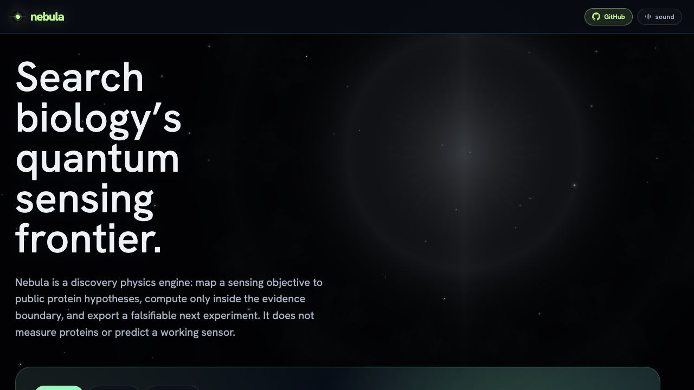
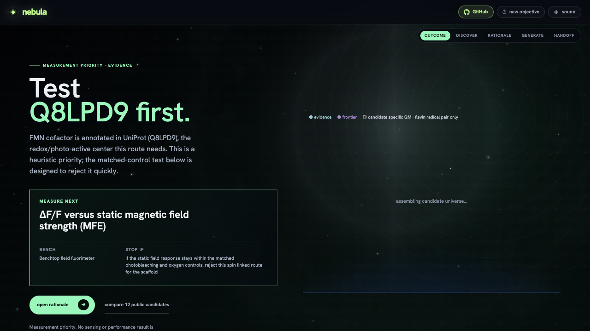
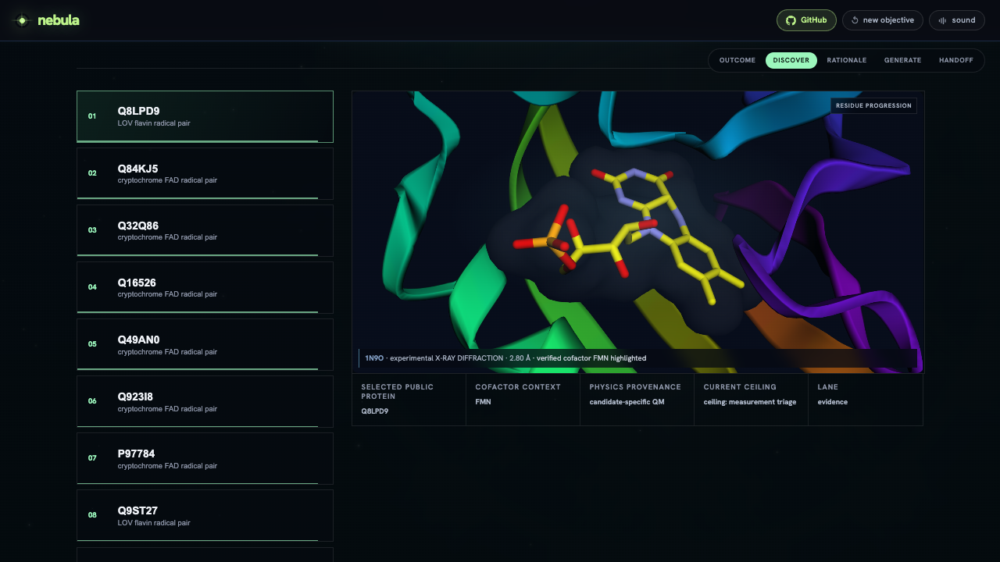
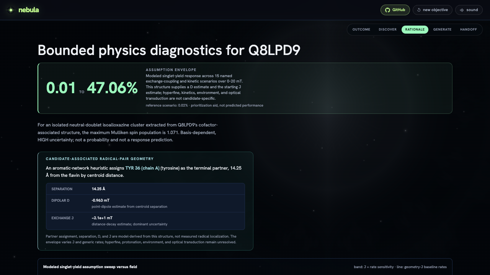
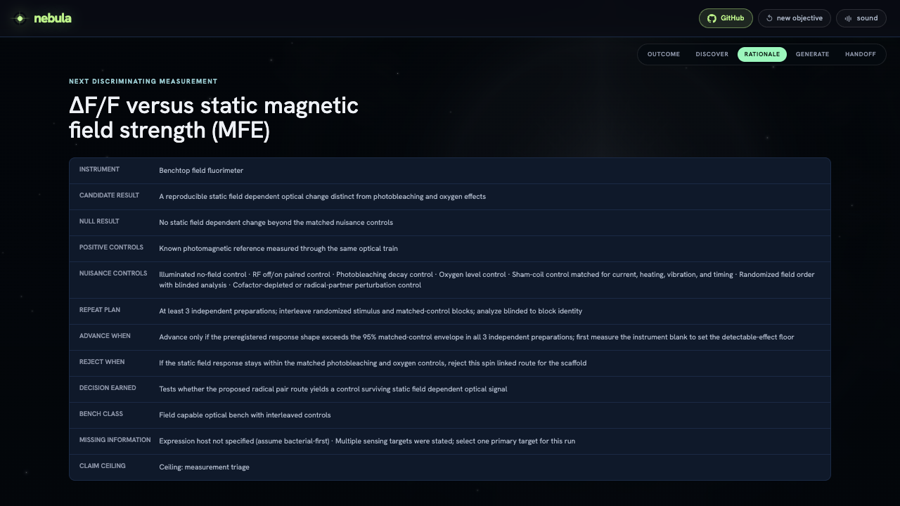
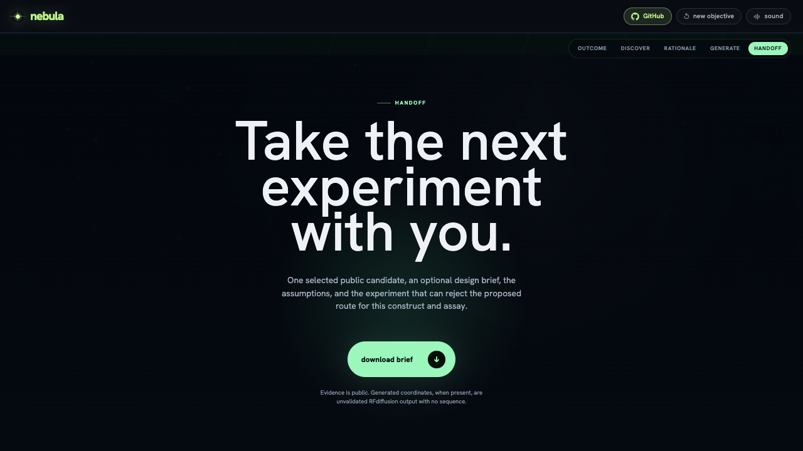
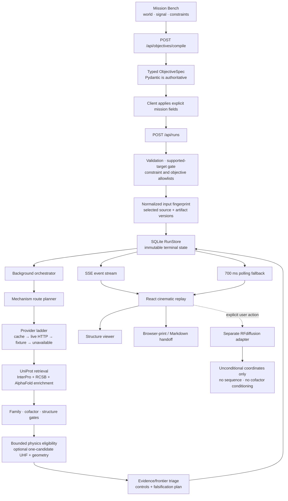

# Nebula

**Search biology's quantum-sensing frontier.**

[](./LICENSE)
[](./CLAUDE_USE.md)
[](https://nebula-discover.greenforest-ed82ac43.westeurope.azurecontainerapps.io)

Nebula is an open discovery physics engine built for the [Built with Claude: Life Sciences](https://cerebralvalley.ai/e/built-with-claude-life-sciences) hackathon using Claude Code. It turns a supported biosensing objective into public protein hypotheses, bounded physics diagnostics, explicit assumptions, and a next experiment designed to reject the hypothesis.

Nebula does **not** measure proteins, predict a working sensor, validate a candidate, or turn simulation into evidence.

**[Launch Nebula — no install](https://nebula-discover.greenforest-ed82ac43.westeurope.azurecontainerapps.io)**



## The decision Nebula exists to make

Protein quantum sensing now has specific experimental precedents, but no general sequence-to-sensor rule. A measurement scientist still faces a harder and more useful question:

> Given a sensing objective, which public mechanism hypothesis is grounded enough to measure next—and what result should make us stop?

| Nebula receives | Nebula returns | Nebula refuses to claim |
| --- | --- | --- |
| Sensed quantity, desired readouts, optional family/cofactor constraints, and practical context | Mechanism routes, public protein records, provenance, bounded diagnostics, open triage axes, controls, nulls, and a rejection rule | Sensitivity, detectability, confidence, probability of success, validated performance, or experimental evidence |

The product is a decision workflow: **objective → mechanism → evidence → assumptions → falsifier → handoff**.

## Why this frontier is real now

Recent primary research demonstrates that proteins can host optically addressable spin or spin-chemistry phenomena under particular constructs and conditions:

| Experimental precedent | What was demonstrated | What it does not establish |
| --- | --- | --- |
| [A fluorescent-protein spin qubit · Nature 2025](https://www.nature.com/articles/s41586-025-09417-w) | Optical spin readout and coherent microwave control at cryogenic temperature; room-temperature ODMR in *E. coli* | That arbitrary fluorescent proteins are useful ambient sensors |
| [Quantum spin resonance in engineered proteins · Nature 2026](https://www.nature.com/articles/s41586-025-09971-3) | Magnetic-field effects and room-temperature ODMR in engineered LOV-family variants, including living bacterial cells | That a database flavoprotein inherits the measured variant's behavior |
| [Optically detected, radio-wave-controlled spin chemistry · Nature Biotechnology 2026](https://www.nature.com/articles/s41587-026-03158-5) | Ambient optically detected and radio-wave-controlled spin chemistry in selected flavoproteins | A universal mapping from structure to sensing response |

These papers establish a frontier, not a recipe. EYFP uses a metastable triplet route. The flavoprotein studies probe spin-correlated radical-pair chemistry whose lifetimes, couplings, photochemistry, environment, and optical transduction are system-specific. Nebula begins with that mechanism distinction before it ranks a protein.

## See one discovery run

*The frames below come from the current deployed interface and the verified seed-1337 demo run. Public database availability can change; every score and modeled value is a triage output under stated assumptions—not a sensing result.*

### 1. Start with the decision



Nebula names Q8LPD9 as a heuristic first measurement priority, proposes ΔF/F versus static magnetic-field strength, and immediately exposes the stop condition: if the response remains inside matched photobleaching and oxygen controls, reject the spin-linked route for that scaffold.

### 2. Keep the public structure attached



The shown run resolves experimental PDB 1N9O, reports the experimental method and resolution, and highlights its verified FMN cofactor. The selected accession, cofactor, physics provenance, lane, and claim ceiling remain visible beside the structure.

### 3. Expose the assumptions



The structure supplies a heuristic terminal aromatic partner, a 14.25 Å centroid separation, a point-dipole D estimate, and an order-of-magnitude starting J estimate. Across the named exchange-coupling and kinetic scenarios, maximum absolute MFE amplitudes range from 0.01% to 47.06%; the plotted band is the pointwise minimum and maximum across their curves over 0–20 mT. It visualizes assumption sensitivity, not a forecast for this protein.

### 4. End with a way to be wrong



The plan names a route-compatible bench scenario, candidate and null outcomes, positive and nuisance controls, independent preparations, a blinded repeat plan, an advance rule, and a rejection rule. Nebula stops before measurement.

### 5. Carry the decision to a collaborator



The browser-print and Markdown handoff carry the accession, public evidence, assumptions, controls, missing information, claim ceiling, and falsifier. Discovery ends where measurement begins.

## Shipped web architecture



### Runtime layers

| Layer | Shipped responsibility | Boundary |
| --- | --- | --- |
| React + TypeScript | Objective builder, three-act state, progress, result narrative, structure/backbone viewers, export, accessibility fallbacks | Does not compute or infer scientific results in the browser |
| Generated OpenAPI types | Keeps the browser client aligned with the Python contracts | Python Pydantic models remain authoritative |
| FastAPI | Validation, rate/body limits, health, routes, run lifecycle, SSE, cancellation, structure and dossier endpoints | Rejects unsupported sensing targets and unenforced hard constraints |
| Background orchestrator | Compile → retrieve → assess physics → simulate compatibility → rank → plan → complete | Linear state machine; failures and cancellation are terminal |
| SQLite RunStore | Persists full typed RunState JSON, events, attempts, and completed outputs | Completed discovery state is immutable except explicit post-run design enrichment |
| Public-data providers | Retrieve and normalize public records with per-call provenance | Missing source fields remain missing; downstream heuristics use disclosed conservative defaults |
| Physics modules | Eligibility, structure extraction, isolated-cluster UHF, radical-pair geometry, scenario envelopes | Computation is diagnostic, not validation |
| Discovery layer | Open heuristic axes, Pareto ordering, evidence/frontier separation, controls and falsifiers | Rank is not probability or predicted performance |
| Optional design adapter | On-demand RFdiffusion coordinate generation | Separate from public-candidate ranking and measurement worthiness |
| Experience layer | WebGL worlds and procedural Web Audio ambience | Atmosphere only; sound is not experimental data |

The deterministic TypeScript pipeline under [src/core](./src/core), including its ten-lens review swarm, is a tested reference implementation. It does **not** power the current React/FastAPI browser journey and Nebula does not claim every browser run passed that swarm.

## Request lifecycle

1. **Mission authoring.** The interface lets a user choose the sensing world, primary quantity, one or more readout modes, and operating context.
2. **Compilation.** The browser sends a bounded phrase to the deterministic compiler, receives an ObjectiveSpec, and explicitly writes the selected mission fields.
3. **Validation.** FastAPI accepts either raw text or a full ObjectiveSpec, rejects unsupported hard constraints/optimization axes, and supports five sensing targets.
4. **Identity.** The service normalizes order-insensitive objective fields and hashes the objective, seed, instrument, one aggregate hash over selected pipeline sources, configuration version, and versioned RadicalPy artifact.
5. **Persistence.** Identical live or completed inputs return the existing run. Failed or cancelled inputs receive a new attempt identifier.
6. **Execution.** Synchronous provider and physics work runs in a background thread; the event loop remains available.
7. **Progress.** SSE replays events and streams state transitions. The browser also polls every 700 ms so proxy buffering cannot freeze the experience.
8. **Completion.** The result is stored before the browser renders the outcome, candidate space, rationale, design lane, and handoff.

## Objective contract: what changes the decision

Nebula keeps search-driving fields separate from deployment context.

| Decision-active | Handoff-only |
| --- | --- |
| Sensed quantity/state | Material or form-factor context |
| Desired readout modalities | Immobilization or integration |
| Optional target families | Temperature range |
| Seed query/accessions | Oxygen condition |
| Allowed/excluded cofactors | Expression host, pH, response time, effect-size request |
| Instrument pin, hard constraints, optimization weights | Context that the current ranker does not computationally enforce |

The current Mission Bench marks sensed quantity and desired modalities as decision-active. Patch format, body warmth, and oxygen travel into the collaborator brief; they do not silently alter the protein rank.

## Mechanism-first route planner

The sensed quantity is the primary route selector. Readouts are a legacy fallback for older expert specs; they cannot silently replace the sensing target.

| Sensed quantity | Search routes in the shipped planner | Required grounding |
| --- | --- | --- |
| Magnetic field or radio-frequency field | Cryptochrome–FAD radical pair; LOV–FMN radical pair | Route-compatible family annotation and FAD/FMN |
| Redox potential | Redox/electrochemical flavoprotein | FAD annotation plus redox/electron-transfer family language |
| Light history | Flavin photochemical route | FMN plus LOV/photoreceptor family language |
| Optical spin contrast | Triplet fluorescent-protein proxy | Explicit fluorescent-protein family; no candidate-specific spin calculation |

Expert family/cofactor controls may narrow an eligible route. They cannot relabel a phototropin as a cryptochrome, force an unrelated seed through a route, or turn an unsupported target into a result.

The public route registry contains additional conceptual entries, but the shipped retrieval planner produces the five routes above. Material-state and metal-confounder entries are not independent protein-search routes in this runtime.

## Public evidence and retrieval

### Provider ladder

```text
NEBULA_OFFLINE=1
  → committed fixture only

live mode
  → fresh local cache (12 h TTL)
  → bounded live HTTP request
  → committed fixture after HTTP failure
  → explicit unavailable result
```

| Provider | Role in the shipped run | What Nebula records |
| --- | --- | --- |
| UniProt | Reviewed-by-default mechanism queries or explicit seed accessions; protein, cofactor, sequence-length, function and cross-references | Endpoint, retrieval mode, timestamps and source metadata where exposed |
| InterPro | Domain/family enrichment used by the strict route gate | Match provenance or explicit degradation |
| RCSB PDB | Experimental entry metadata, bound components, resolution, and mmCIF coordinates | Structure source, method, resolution, cofactor and retrieval provenance |
| AlphaFold DB | Structure fallback when no eligible cofactor-bound experimental structure resolves | Prediction source and model confidence context |

FPbase support exists in the provider library and health probe, but it is not in the current candidate-assembly request path.

Every route carries evidence cards with relations such as **supports**, **requires**, **assumes**, **confounded by**, **falsified by**, and **caps claim at**. Literature anchors mechanism plausibility; it never validates a returned accession.

## Physics: what is calculated, and what is not

### 1. Physics eligibility is a gate

A candidate first needs route-compatible public evidence. Flavin radical-pair routes require an annotated FAD/FMN cofactor. Proxy routes can enter exploration only under their own ceiling. Ineligible candidates cannot enter a computed lane.

Eligibility means “the route can be parameterized under declared assumptions.” It does not mean “the protein is a sensor.”

### 2. Experimental structure selection

For each public record, Nebula inspects a bounded number of PDB cross-references, excludes structures missing the route's required bound cofactor, and keeps the best available resolution. AlphaFold is a structural fallback, but only a cofactor-bound experimental structure can donate real flavin coordinates to the candidate-specific cluster path.

The expensive UHF step is bounded to **at most one candidate per run**: the eligible flavin candidate with the best-resolution cofactor-bound experimental structure.

### 3. Candidate-specific isoalloxazine cluster

From the selected mmCIF, Nebula:

- finds a bound flavin ligand;
- retains the redox-active isoalloxazine atom set;
- truncates the ribityl/adenine tail;
- places a 1.01 Å hydrogen cap at N10 toward the removed C1′ direction;
- assumes a neutral doublet, charge 0 and spin 1;
- runs an unrestricted Hartree–Fock single point with the 6-31G basis in an isolated subprocess;
- reports convergence, energy, wall time, atom-resolved Mulliken spin populations, the maximum absolute spin population, and the number of sites above 0.05.

The implemented Mulliken population contracts the spin-density matrix with the AO overlap matrix:

> AO spin population = diag[(Dα − Dβ)S], then summed by atom.

This is basis-dependent, fixed-geometry, and highly truncated. It omits the radical partner, protein electrostatics, alternative protonation states, solvent, conformational ensembles, dynamics, and optical transduction. A converged calculation does not increase the plausibility score.

The default container replays committed content-addressed cache entries where available. [Dockerfile.physics](./Dockerfile.physics) adds PySCF for uncached attempts; an unavailable or non-converged calculation remains explicitly uncomputed.

### 4. Structure-associated radical-pair geometry

Using the same cofactor-bound structure, Nebula builds a graph containing the flavin isoalloxazine and same-chain tryptophan/tyrosine aromatic rings. Two rings connect when their closest heavy atoms are within 9.0 Å. Dijkstra traversal starts at the flavin; the geodesically farthest reachable aromatic becomes the heuristic terminal partner.

The displayed separation r is the rounded flavin-to-partner centroid distance. Nebula then derives two model inputs:

> J(r) = 9.7 × 10⁹ exp(−14 × 10⁹ r) mT

> D(r) = −[(3 gₑ μB μ₀) / (8πr³)] × 10³ mT

Here r is in metres. J is an order-of-magnitude distance-decay estimate and the dominant uncertainty; D is an isotropic point-dipole estimate. Neither is a measured radical localization or a complete spin Hamiltonian.

### 5. Candidate-associated magnetic-field-effect envelope

Nebula uses RadicalPy with a model flavin anion and tryptophan cation, retaining one class-level hyperfine nucleus per radical: flavin N5 and tryptophan Hβ1. Candidate geometry contributes D and the starting J estimate; hyperfine values are **not** computed for the candidate.

For each scenario and field, the singlet yield is evaluated through the Liouvillian inverse:

> ΦS(B) = kS Re[PS · (−L(B)⁻¹ρ₀)]

and normalized against zero field:

> MFE(B) = 100 × [ΦS(B) − ΦS(0)] / ΦS(0)

The candidate envelope uses 41 field points over 0–20 mT. It crosses up to three J conditions—geometry J, capped weak J, and negligible J—with five explicit rate sets:

| Rate set | kS (s⁻¹) | kT (s⁻¹) | relaxation (s⁻¹) |
| --- | ---: | ---: | ---: |
| Long lived | 3×10⁵ | 3×10⁵ | 1×10⁵ |
| Baseline | 1×10⁶ | 1×10⁶ | 1×10⁶ |
| Fast recombination | 3×10⁶ | 3×10⁶ | 1×10⁶ |
| Relaxation dominated | 1×10⁶ | 1×10⁶ | 3×10⁶ |
| Singlet biased | 3×10⁶ | 3×10⁵ | 1×10⁶ |

That creates a maximum of 15 named scenarios; duplicate J conditions are deduplicated. The band is the min/max across those assumptions. It is **not** a confidence interval, candidate response, predicted sensitivity, or detectable optical signal.

### 6. Separate mechanism-class reference artifact

The repository also contains a versioned RadicalPy reference artifact for a model flavin–tryptophan radical pair:

- 0–50 mT MARY sweep with denser low-field sampling;
- nominal Haberkorn recombination and random-field relaxation;
- no-hyperfine and fast-relaxation counterfactuals;
- an RF eigengap illustration over 1–120 MHz whose normalized amplitudes are arbitrary.

This artifact shows how an assumed mechanism behaves and what collapses under counterfactuals. It is not Q8LPD9, not a calibration to a measured protein, and not a performance forecast.

## Ranking: open heuristics, never probability

Nebula exposes seven unitless axes:

| Axis | Implemented meaning |
| --- | --- |
| P · plausibility | Resolved mechanism fraction, route template, cofactor/chromophore grounding, and experimental structure |
| M · measurability | Route/instrument compatibility plus a shared artifact-derived signature for eligible spin routes; proxy routes receive only an observable-in-principle gate |
| D · developability | Evidence confidence, structure confidence, reviewed status, and a coarse sequence-length window |
| N · novelty | Declared exploration novelty; never contributes to plausibility or predicted performance |
| U · uncertainty | Unresolved mechanism fraction and missing structure confidence |
| IG · information gain | Uncertainty worth resolving, modulated by measurability, objective alignment, and claim ceiling |
| C · cost | Coarse route, hardware, structure, and calculation burden |

The current formulas and gates are intentionally inspectable:

> P = clamp[0.45(1 − unresolved) + 0.25(route template) + 0.20(cofactor/chromophore grounding) + 0.10(experimental structure)]

> D = clamp[0.40(evidence confidence) + 0.30(structure confidence) + 0.20(reviewed factor) + 0.10(length factor)]

> U = clamp[0.60(unresolved) + 0.40(1 − structure confidence)]

> IG = clamp[U × (0.35 + 0.65M) × claim potential × (0.50 + 0.50 objective alignment)]

Measurability first checks whether the chosen instrument can read the route. Compatible analytic-proxy routes receive the declared `0.5` observable-in-principle gate. Eligible spin routes compare the shared versioned reference-artifact signature `A` with the instrument noise floor `n`: below `A/n = 1`, `M = 0`; otherwise `M = clamp[0.5 + 0.5 log10(A/n) / log10(30)]`.

Novelty is a declared lookup across exploration levels L0–L4: `0.10, 0.40, 0.70, 0.85, 0.95`. Cost begins at `0.25`, then adds `0.20` for triplet/RF hardware, `0.20` for electrochemistry, `0.15` when no experimental structure resolves, and `0.10` when a QM-cluster plan exists.

When structure confidence is missing, developability and uncertainty use the explicit heuristic default `0.30`; when sequence length is missing, developability uses `300` residues. Those defaults do not fill the public source record.

Evidence-lane entry requires an L0 known-family hypothesis with `P ≥ 0.50` and `M ≥ 0.15`. Frontier entry requires `P ≥ 0.25`, `M ≥ 0.15`, and explicit controls; analytic proxies can enter only this frontier lane. Evidence candidates are Pareto-ranked on P/M/D. Frontier candidates are Pareto-ranked on IG/N, then quality-diversity ordered by mechanism primitive. User weights break ties within those structures; they do not create a global weighted leaderboard. The utility is not a calibrated likelihood.

### Two discovery lanes

- **Evidence lane:** known-family candidates that clear plausibility and measurability floors; Pareto objectives are P, M, and D.
- **Frontier lane:** measurable, controlled hypotheses that clear lower plausibility floors; Pareto objectives are IG and N, with quality-diversity ordering across mechanism primitives.

Novelty and uncertainty never lift plausibility, measurability, developability, or predicted performance. Candidate-specific UHF never rewards a candidate merely because a calculation ran.

## From rank to falsification

The selected candidate is the first evidence-lane candidate, otherwise the first frontier experiment. Route-specific planning emits:

- observable and route-compatible bench class;
- candidate and null outcomes;
- positive and nuisance controls;
- randomized/blinded repeat plan;
- advance and rejection rules;
- missing information and assumptions;
- decision earned and claim ceiling.

For the demo route, the decisive rejection rule is explicit:

> If the static-field response stays within matched photobleaching and oxygen controls, reject the spin-linked route for that scaffold.

Prospective validation belongs to a measurement collaborator; Nebula's software handoff stops at the experiment and rejection rule.

## Caching, identity, and reproducibility

| Layer | Cache/identity | Scientific role |
| --- | --- | --- |
| Run | SHA-256 over normalized objective, seed, instrument, config, one aggregate selected-pipeline-source hash, provider-version labels, and the versioned reference artifact | Idempotency and stale-result reduction; not proof of global bitwise reproducibility |
| Provider | 12-hour local disk cache before live HTTP; fixture fallback | Availability and provenance |
| Candidate UHF | Content-addressed geometry/basis/worker cache | Avoids repeating an identical bounded diagnostic |
| Candidate MFE | Content-addressed D/J/scenario/version cache | Replays an identical assumption envelope |
| RFdiffusion | Process-memory LRU, default 8 entries and 6-hour TTL, keyed by model/count/length/contig | GPU acceleration only; never a ranking or evidence layer |

The run fingerprint does not hash every repository file or live provider payload. Reproducibility claims are therefore narrow: same normalized inputs and the tracked identity components can return the same stored run; external public records and un-hashed code can still change.

## Separate design frontier

Every completed run first receives deterministic, coordinate-free design briefs. If a deployer explicitly connects the Modal adapter, the user may request real RFdiffusion backbones after discovery completes.

The current production call:

- uses RFdiffusion Base;
- requests three 100-residue monomer backbones;
- passes no contig, so generation is unconditional;
- returns coordinates only;
- produces no sequence;
- is not conditioned on the selected protein, cofactor pocket, sensing mechanism, or assay;
- does not affect the public-protein rank;
- degrades to the labeled preview on failure or quota exhaustion.

Cross-run identical geometry requests can hit the process cache. In the verified demo, a seed-isolated replay returned the same three coordinate sets with provenance **memory_hit** and the same cache-key prefix. The sanitized [cache proof](./docs/provenance/demo-cache-proof.json) records both run identifiers without publishing coordinates. This demonstrates compute reuse, not scientific equivalence.

ProteinMPNN and LigandMPNN remain adapter seams/reference code, not shipped design executions.

## API surface

| Endpoint | Purpose |
| --- | --- |
| GET /api/health | Provider reachability, offline mode, adapter mode and API version |
| GET /api/routes | Public route registry |
| GET /api/instruments | Route-compatible instrument scenarios |
| POST /api/objectives/compile | Raw objective → ObjectiveSpec |
| POST /api/runs | Validate and create/idempotently return a run |
| GET /api/runs/{id} | Full typed run state |
| GET /api/runs/{id}/events | SSE progress replay and stream |
| POST /api/runs/{id}/cancel | Terminal cancellation |
| POST /api/runs/{id}/designs | On-demand, post-run design generation |
| GET /api/candidates/{id}/dossier | Candidate dossier |
| GET /api/candidates/{id}/structure | Experimental structure or AlphaFold fallback |

Production serves the built React application and API from one FastAPI container.

## Failure behavior and safety controls

- Unsupported sensing targets return 422 with the supported target list.
- Unknown hard constraints or optimization axes return 422 rather than appearing enforced.
- Requests declaring a `Content-Length` above 64 KiB are rejected.
- Public run creation is rate-limited per client and bounded by active worker capacity.
- Provider failures degrade through cache/fixture paths or become explicit unavailability.
- Non-converged or timed-out UHF output is discarded.
- Illegal state transitions fail.
- Terminal discovery runs cannot be revived by stale workers.
- Generated-design enrichment is the only allowed completed-run mutation.
- Security headers include a content-security policy, no-sniff, referrer, permissions, and cross-origin protections.

## Repository map

```text
src/ui/discover/             React experience, objective builder, result narrative, audio
src/api/                     Handwritten browser client using generated contract types
src/contracts/api.ts         Types generated from the FastAPI OpenAPI schema
backend/app/contracts/       Authoritative Pydantic schemas
backend/app/objective/       Deterministic objective compiler
backend/app/retrieval/       Route plans, evidence cards, candidate assembly
backend/app/providers/       UniProt, InterPro, RCSB, AlphaFold and fixture/cache ladder
backend/app/physics/         Eligibility, cluster extraction, UHF worker, radical-pair diagnostics
backend/app/discovery/       Capability, mechanism graph, scoring, lanes and falsification
backend/app/jobs/            Fingerprinting, orchestration and SQLite persistence
backend/app/design/          Preview seam, Modal RFdiffusion adapter and process cache
scripts/physics/             Versioned RadicalPy reference-artifact generator
infra/modal/                 Bring-your-own-compute RFdiffusion deployment
tests/ + backend/tests/      Contract, science-boundary, API, provider and UI tests
docs/                        Architecture notes, adapter boundaries and media
artifacts/claude/            Dated build/review provenance
```

Navigate through the [documentation index](./docs/README.md), [script index](./scripts/README.md), and [artifact index](./artifacts/README.md). They distinguish shipped runtime documentation, reference material, operational helpers, public provenance, and ignored local output without moving paths used by the application or automation.

## Quickstart

### Docker

```bash
docker compose up --build
# open http://localhost:8000
```

Deterministic fixtures, seed-stable behavior, and no public-API traffic:

```bash
NEBULA_OFFLINE=1 docker compose up --build
```

### Developer mode

```bash
npm ci
python3 -m pip install -e './backend[dev,physics]'

# terminal 1
cd backend
python3 -m uvicorn app.api.main:app --host 127.0.0.1 --port 8000

# terminal 2, repository root
npm run dev
```

Open <http://127.0.0.1:5173>. Omit the physics extra for the lighter cache-only QM path. Native scientific packages may require a compiler toolchain.

## Host it yourself

```bash
docker build -t nebula .
docker run -p 8000:8000 nebula
```

| Variable | Default | Purpose |
| --- | --- | --- |
| NEBULA_OFFLINE | 0 | 0 uses the live/cache/fixture ladder; 1 requires committed fixtures |
| NEBULA_RUN_DB | repository artifact path | SQLite path; use :memory: for isolated tests |
| NEBULA_CORS_ORIGINS | localhost development origins | Explicit cross-origin allowlist |
| NEBULA_STATIC_DIR | unset locally; /app/dist in container | Serve the built React application |
| NEBULA_MAX_ACTIVE_RUNS | 2 | Bound concurrent discovery/generation tasks |
| NEBULA_RUNS_PER_MINUTE | 20 | Per-client public run cap |
| NEBULA_DESIGN_ADAPTER | preview | Set modal only with deployer-owned URL and token |
| NEBULA_RFDIFFUSION_CACHE_MAX_ENTRIES | 8 | Process-local design-cache bound |
| NEBULA_RFDIFFUSION_CACHE_TTL_SECONDS | 21600 | Process-local design-cache TTL |
| NEBULA_MODAL_MAX_PER_DAY | 80 | Per-process generation cap; not a durable global quota |

See [docs/DESIGN_ADAPTERS.md](./docs/DESIGN_ADAPTERS.md) for the optional GPU adapter.

## Verification

Run the release checks:

```bash
npm test
npm run build
cd backend && python3 -m pytest -q
cd .. && npm run e2e
```

The repository includes tests for route gates, evidence relations, DOI shape/parity, scoring separation, claim ceilings, physics cache behavior, provider degradation, API hardening, RFdiffusion boundaries, accessibility, responsive UI, and deterministic reference-swarm behavior.

## Claim boundary

- A candidate is a hypothesis to measure, not a validated sensor.
- A rank is an uncalibrated ordering, not probability.
- The UHF value is an isolated-cluster diagnostic, not whole-protein spin physics.
- The candidate MFE band is a scenario envelope, not confidence or predicted response.
- The shared RadicalPy artifact is a mechanism-class reference, not a candidate calculation.
- A route-compatible instrument is a measurement scenario, not an equipment recommendation or proof of detectability.
- RFdiffusion produces unvalidated unconditional coordinates with no sequence.
- Nebula creates no measurements or experimental evidence.

See [IP_BOUNDARY.md](./IP_BOUNDARY.md) for the public/private boundary.

## AI-assisted development

Nebula was built with repository-visible assistance from Claude Code: agents, skills, commands, and dated decision records remain in the public tree. The contracts, claim firewall, interface, tests, and build history are inspectable in [CLAUDE_USE.md](./CLAUDE_USE.md), [CLAUDE_TRANSPARENCY.md](./CLAUDE_TRANSPARENCY.md), [.claude/](./.claude), and [artifacts/claude/](./artifacts/claude).

During development, a private memory note in a local vault—linked into a wider project knowledge graph—served as the cross-session ledger for stable decisions, scientific boundaries, corrections, and working preferences. AI sessions were instructed to read that note at startup, so stable context did not have to be manually restated in every prompt. This was a token-efficiency design, not a benchmark; no quantitative saving is claimed. The private note is not required to run, audit, or reproduce Nebula, and public implementation evidence remains in this repository.

Claude does not run inside the shipped application. AI output is never treated as experimental evidence.

## Project status

Nebula is an early working research tool.

| Capability | Status |
| --- | --- |
| Objective compiler, mechanism routing, public retrieval and strict route gates | Implemented |
| Structure-associated radical-pair geometry | Implemented for an eligible cofactor-bound experimental structure |
| At most one candidate-specific UHF cluster attempt per run | Implemented; cache-only in the slim image, live with PySCF image |
| Candidate D/J and kinetic scenario envelope | Implemented; assumptions, not response |
| Evidence/frontier ordering and falsification handoff | Implemented |
| Deterministic offline fixtures and seed 1337 | Implemented |
| Optional on-demand RFdiffusion coordinates | Implemented; separate, unconditional, no sequence |
| Browser-runtime adversarial swarm | Not implemented; TypeScript swarm is reference-only |
| Calibrated performance model, broad mechanism coverage, prospective measurement validation | Not claimed |

## Contributing

Issues and pull requests are welcome, especially route-gating counterexamples, paper-to-claim mismatches, missing controls, unsafe inference paths, and objectives that should stop earlier.

## License and contact

[MIT](./LICENSE). Free to use, fork, and build on.

Built and maintained by Aniruddh Goteti. Collaboration: [aniruddh.goteti@orbion.life](mailto:aniruddh.goteti@orbion.life).
